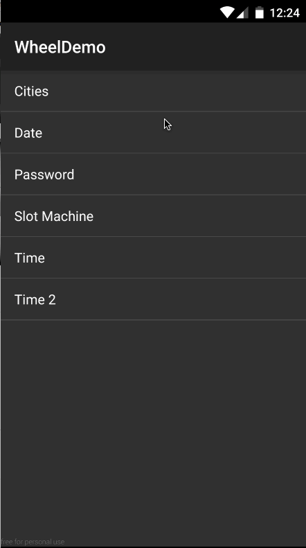

# The wheel widget for Android.
[  ](https://bintray.com/isanwenyu/maven/android-wheel/_latestVersion)

## Quick Overview


<p>

</p>
<p>
</p>

<p>
</p>

## Getting Started

 > Add the dependency to your build.gradle.
 
```
dependencies {
 	compile 'com.isanwenyu.android-wheel:wheel:2.1'
}
```
- Maven:

```
<dependency>
  <groupId>com.isanwenyu.android-wheel</groupId>
  <artifactId>wheel</artifactId>
  <version>2.1</version>
  <type>pom</type>
</dependency>
```
## Features ##
  * Scrolling
  * Customized items
  * Customized label
  * Event listeners